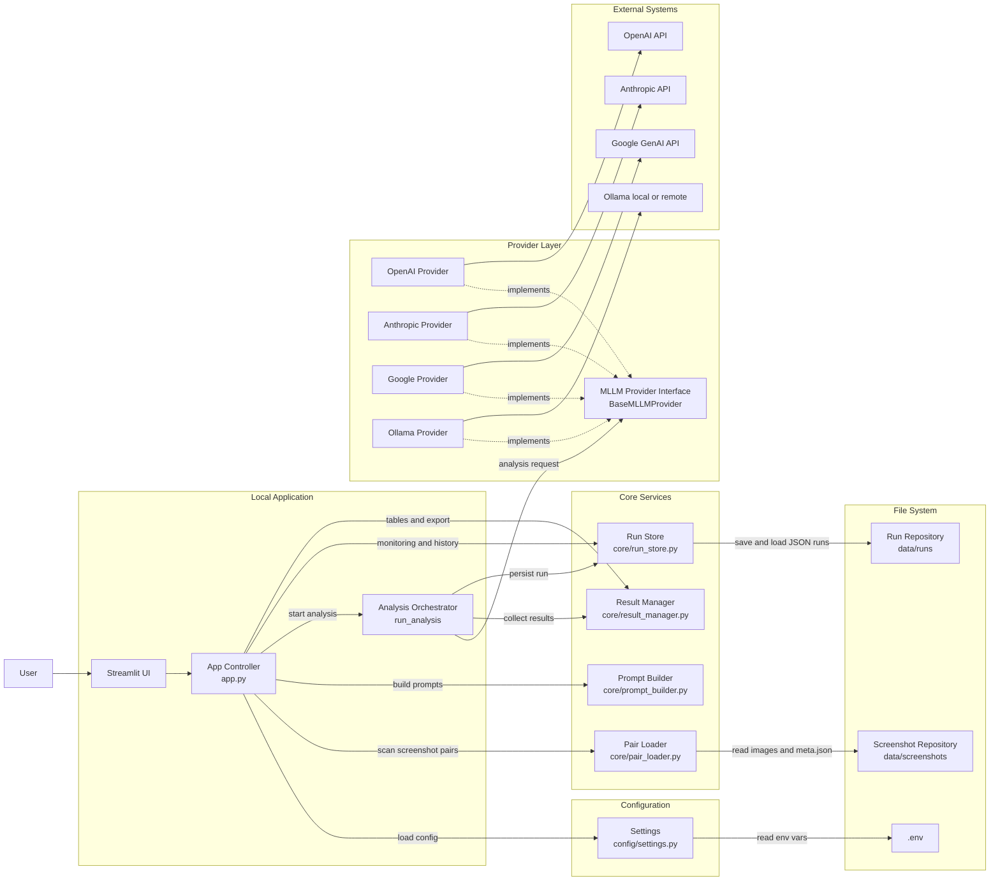

# Repository Architecture

```mermaid
flowchart LR
    user["User"]

    subgraph local["Local Application"]
        ui["Streamlit UI"]
        app["App Controller\napp.py"]
        orch["Analysis Orchestrator\nrun_analysis"]
    end

    subgraph config["Configuration"]
        settings["Settings\nconfig/settings.py"]
    end

    subgraph core["Core Services"]
        pair["Pair Loader\ncore/pair_loader.py"]
        prompt["Prompt Builder\ncore/prompt_builder.py"]
        results["Result Manager\ncore/result_manager.py"]
        runstore["Run Store\ncore/run_store.py"]
    end

    subgraph providers["Provider Layer"]
        provider_if["MLLM Provider Interface\nBaseMLLMProvider"]
        openai_p["OpenAI Provider"]
        anthropic_p["Anthropic Provider"]
        google_p["Google Provider"]
        ollama_p["Ollama Provider"]
    end

    subgraph fs["File System"]
        screenshots["Screenshot Repository\ndata/screenshots"]
        runs["Run Repository\ndata/runs"]
        env[".env"]
    end

    subgraph external["External Systems"]
        openai_api["OpenAI API"]
        anthropic_api["Anthropic API"]
        google_api["Google GenAI API"]
        ollama_api["Ollama local or remote"]
    end

    user --> ui
    ui --> app

    app -->|load config| settings
    settings -->|read env vars| env

    app -->|scan screenshot pairs| pair
    pair -->|read images and meta.json| screenshots

    app -->|build prompts| prompt
    app -->|start analysis| orch

    orch -->|analysis request| provider_if

    openai_p -.->|implements| provider_if
    anthropic_p -.->|implements| provider_if
    google_p -.->|implements| provider_if
    ollama_p -.->|implements| provider_if

    openai_p --> openai_api
    anthropic_p --> anthropic_api
    google_p --> google_api
    ollama_p --> ollama_api

    orch -->|collect results| results
    orch -->|persist run| runstore
    runstore -->|save and load JSON runs| runs
    app -->|monitoring and history| runstore
    app -->|tables and export| results
```

Hinweise:

- `app.py` kombiniert UI, Session State und Workflow-Steuerung.
- Die Persistenz ist dateibasiert; es gibt kein separates Backend und keine Datenbank.
